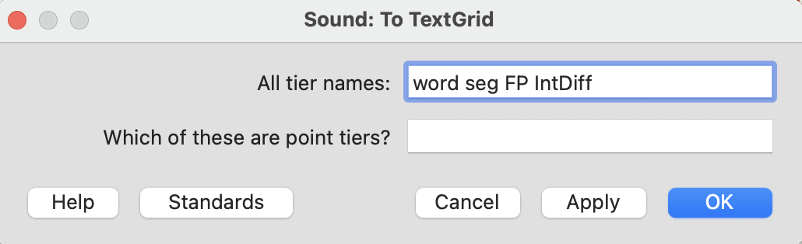

```{css, echo=FALSE}
/* Change the font size for the main body text to 18px */
body {
  font-size: 18px;
}
```

## The realization of /ʎ/

In Portuñol, the phonological target /ʎ/ is realized in different ways. The surface realization will be either:

| Realization | Description                  |   Audio example                                     |
|-------------|------------------------------|-----------------------------------------------------|
| **[ʎ]**     | **Palatal lateral approximant**: reduced intensity relative to vowels; weak formants; no strong frication  |   |
| **[lj]**        | **Lateral followed by glide**: two phase structure; early vowel/glide; bi-phasic intensity contour     | ---                                                    |
|**[j]**        | **Palatal approximant**: glide; strong formants; intensity similar to vowels; flat intensity          |           |
| **[l]**         | **Alveolar lateral approximant**: no palatal cues; alveolar like formants; mid-level intensity |  |
| **[ʒ]**         | **Voiced palato-alv sibilant**: audible frication; little or no formant; intensity may be high   |                            |
| **0**           | **Deletion**: Vowel-to-vowel transition; near-zero duration                     | ---                                                    |

## Annotation tiers

You will be working with a sound file and creating a TextGrid in Praat. The way you do this is by:

- Open the sound file, then got to "Annotate" > "To TextGrid"
- This will give you a pup-up window specifying the tiers for the TextGrid
  + name the tiers: word, seg, FP, IntDiff (please adhere to the capitalization of these tier names for the sake of consistency when we process the audio and TextGrid)
  + single space between tier names
  
  {width=50%}
  
>   
### Word tier

This tier will have boundaries for the onset and offset of the word. The word segment will be labelled with the *target* word as it appears in the [word list](docs/word_list.pdf). This is the *predicted pronunciation* of the Portuñol target.

>
### Seg tier

This is the segment tier. This is a **very**important tier. We will be segmenting the V-C-V as the target. The Cs will be one of the /ʎ/ realizations above. It is important that we LISTEN CAREFULLY at the VCV and select the correct realization of the C. Segmentation will be hard, so listening multiple times will be essential. Consulting with Profs. Machado or Narayan will be important for problematic tokens (of which there will be many!).

>
### FP tier

This tier will be a copy of the seg tier, but labelled differently. This tier will be used for the FormantPro script which will be run on the TextGrid/Sounds after the annotation. When these are labeled add the word number followed by the segment label. For example, for the word "ojo", which is word #5, the VCVs should be labelled 5-o1, 5-C, 5-o2, with "C" being the consonant realization, so it might be 5-o1, 5-lj, 5-o2. The "o1" and "o2" are "V1" and "V2" so we know which vowel we're talking about.

>
### IntDiff tier

This tier will be used with Prof. Beristain's IntDiff Praat script, which computes the intensity differnce between the C and the following vowel. For this segmentation, the borders should capture the minimum intensity of the C and the maximum intensity of the following V. The segmentation here does not need to be exact but it should capture these max and min intensities in the region that is bordered. The IntDiff tier should be labelled with the C and the following V2. So with a word like "mujerona", this tier would be labeled "je."

Below is an example of what the TextGrid + sound will look like after annotation for the sound "mujerona" (with deletion of the consonant).


Please watch this [video](https://drive.google.com/file/d/1b1GHqO5kMTPRY_4AXtn89H_jM0Ls8Mbj/view?usp=sharing) as it shows the step-by-step procedure. It also shows a 0 (deletion) of the target C. This [video](https://drive.google.com/file/d/1Oi3kuvJvDhfx9E4FbjFj3OgH6GZDC4Rj/view?usp=sharing) shows the very next production that has the clear glide

"Mujerona" with deletion
\


"Mujerona" with clear glide (see F2 positive slope)


\\


