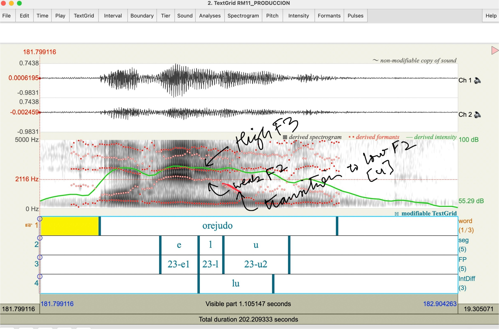

```{css, echo=FALSE}
/* Change the font size for the main body text to 18px */
body {
  font-size: 18px;
}
```


## Examples of different realizations of /ʎ/

<style type="text/css">
.tg  {border-collapse:collapse;border-color:#ccc;border-spacing:0;}
.tg td{background-color:#fff;border-color:#ccc;border-style:solid;border-width:1px;color:#333;
  font-family:Arial, sans-serif;font-size:14px;overflow:hidden;padding:10px 5px;word-break:normal;}
.tg th{background-color:#f0f0f0;border-color:#ccc;border-style:solid;border-width:1px;color:#333;
  font-family:Arial, sans-serif;font-size:14px;font-weight:normal;overflow:hidden;padding:10px 5px;word-break:normal;}
.tg .tg-c3ow{border-color:inherit;text-align:center;vertical-align:top}
.tg .tg-0pky{border-color:inherit;text-align:left;vertical-align:top}
</style>
<table class="tg"><thead>
  <tr>
    <th class="tg-c3ow">Realization</th>
    <th class="tg-c3ow">Acoustics</th>
    <th class="tg-c3ow">Spectrogram</th>
  </tr></thead>
<tbody>
  <tr>
    <td class="tg-0pky">[j]</td>
    <td class="tg-0pky">F2 rise<br>Fall in F3<br>Look for change in waveform<br></td>
    <td class="tg-0pky"><br></td>
  </tr>
  <tr>
    <td class="tg-0pky">[ʎ]</td>
    <td class="tg-0pky">High F2<br>Low F1</td>
    <td class="tg-0pky"><br></td>
  </tr>
  <tr>
    <td class="tg-0pky"><span style="font-weight:400;font-style:normal">[</span>ʃ]</td>
    <td class="tg-0pky">Mid-high frequency noise<br>No voice bar</td>
    <td class="tg-0pky"><br></td>
  </tr>
  <tr>
    <td class="tg-0pky">[l]</td>
    <td class="tg-0pky">High F3<br>Weak F2<br>Reduced amplitude of waveform</td>
    <td class="tg-0pky"><br><span style="font-weight:400;font-style:normal"></span><br></td>
  </tr>
  <tr>
    <td class="tg-0pky">0</td>
    <td class="tg-0pky">Vowel-to-vowel hiatus<br>Small transition between vowels</td>
    <td class="tg-0pky"><br></td>
  </tr>
  <tr>
    <td class="tg-0pky"></td>
    <td class="tg-0pky"></td>
    <td class="tg-0pky"></td>
  </tr>
</tbody></table>