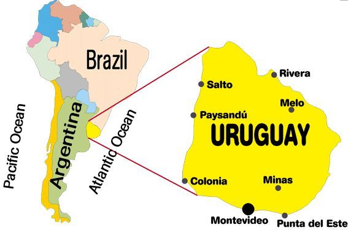

```{css, echo=FALSE}
/* Change the font size for the main body text to 18px */
body {
  font-size: 18px;
}
```

This is the landing site for the Rivera Acoustics Project. All documents and tutorials for segmenting and measurement will be found here.

# Background

This project began when [Prof. Vanina Machado](https://vaninamachado.wordpress.com/) was a postdoc at York with Prof. Narayan. Prof. Machado was interested in the Uruguayan Portuguese (Portuñol) community on the border of [Uruguay](https://en.wikipedia.org/wiki/Uruguay) and [Brazil](https://en.wikipedia.org/wiki/Brazil), in the town of [Rivera](https://en.wikipedia.org/wiki/Rivera). We are collaborating with [Prof. Ander Beristain](https://www.slu.edu/arts-and-sciences/linguistics-literatures-cultures/faculty/beristain-ander.php) who will be helping with analysis once we do the segmentation and annotations. 

<center>
{width=50%}
</center>

# Portuñol

The Portuñol variety we will be analyzing is a mixture of Brazilian Portuguese and Uruguayan Spanish. Here's what Wikipedia says about Portuñol:

Portuñol/Portunhol is frequently a pidgin, or simplified mixture of the two languages, that allows speakers of either Spanish or Portuguese who are not proficient in the other language to communicate with one another. When speakers of one of the languages attempt to speak the other language, there is often interference from the native language, which causes the phenomenon of code-switching to occur. It is possible to conduct a moderately fluent conversation in this way because Portuguese and Spanish are closely related Romance languages.


# /ʎ/

We are analyzing how Portuñol speakers pronounce the /ʎ/ **"lh"** sound, which  does not *surface* uniformly. A word like *mulher* ("woman") can surface as [muljer], [mujer], [muler], [muʒer] or with oral features deleted [muʔer].

These outcomes reflect varying degrees of palatalization, assimilation, weakening (lenition), fricativization, and deletion. Crucially, **these are not errors, but rather they are the phenomenon under study.**

# Production task

Fifteen men and 15 women participated in the field production task conducted by Prof. Machado and a research assistant in Rivera. The participants read a [word list](word_list.pdf) consisting of 28 words which are 2-4 syllables long. The speakers were given a word in Spanish and their "predicted" production is in Portuñol. 30 speakers x 28 words = 840 tokens (roughly as some speakers repeat tokens).

The recordings are not made in a studio so there is often environmental noise, though the researchers tried to keep it as quiet as possible. The recordings also have the talking by the researchers as the speakers needed to sometimes instruct the participants to use the Portuñol variety as opposed to Spanish or Portuguese. Keep in mind that there are social (gender and class) influences on the use of Portuñol.

# Annotation task

Research assistants at the SAP Lab will be segmenting and annotating the audio files using Praat with associated TextGrids. Please see the [Annotation](annotation.html) tab above which will detail how to go about proceeding with the annotation task. 

Once the sound files are annotated with TextGrids, there will be two scripts that will be run on the files. The scripts will capture duration and formant information (one script) and intensity information (different script). 